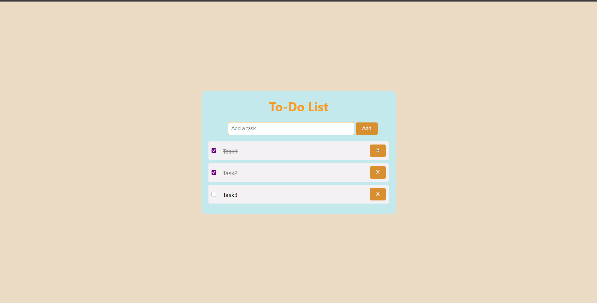

# 📝 To-Do List App

A simple and clean **To-Do List** built using **HTML, CSS, and JavaScript**.

This project allows users to add, mark, and delete tasks dynamically in the browser.

---

## 🚀 Features

- Add new tasks dynamically  
- Mark tasks as completed using checkboxes  
- Delete individual tasks  
- Clean and responsive design with smooth UI  
- Live updates without page refresh

---

## 📁 Project Structure

```
To-Do-List/
│
├── index.html          # Main HTML file
├── css/
│   └── style.css       # Styling for the app
├── Js/
│   └── main.js         # JavaScript logic for todos
└── README.md           # Project description and instructions
```

---

## 🎨 Technologies Used

- **HTML5**  
- **CSS3**  
- **Vanilla JavaScript (ES6)**

---

## 📸 Preview



---

## 📦 How to Use

1. Clone the repository or download the files:
   ```bash
   git clone https://github.com/your-username/todo-list.git
   ```

2. Open `index.html` in your browser:
   ```bash
   open index.html
   ```

3. Start typing your tasks and click `Add`.

---

## 🧠 How It Works

- Tasks are stored in an array called `todos[]`.
- The `addTodo()` function pushes new tasks.
- The `showTodos()` function re-renders the list using `innerHTML`.
- `toggleTodo()` handles checkbox updates.
- `onDelet()` removes tasks by index.

---

## ✨ Customization Ideas

- Add localStorage to persist tasks
- Add due dates or categories
- Add animations or sound effects
- Use frameworks like React or Vue later

---


> Made with ❤️ using HTML, CSS, and JavaScript.
